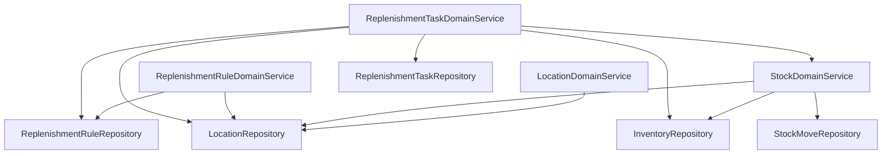

# Diseño de Arquitectura — Módulo de Reabasto WMS

| | |
|---|---|
| **Versión** | 1.0 |
| **Estado** | Aprobado |
| **Fecha** | 2026-09-20 |
| **Depende de** | [`SRS.md`](SRS.md) v1.0 (dominio, requisitos, decisiones D1–D15) |

---

## 1. Propósito y Alcance

Este documento define el **cómo**: cómo se distribuye el modelo de dominio del SRS en los módulos
`domain` / `api` / `infra` ya existentes, qué decisiones técnicas cierran cada requisito no funcional, y
cómo se sostiene la atomicidad y la concurrencia sin base de datos. No repite el modelo de dominio ni los
requisitos funcionales — están en `SRS.md` y se referencian por ID (FR-*, NFR-*, BR-*, D*).

El diseño respeta las convenciones ya verificadas en el código base (`../CLAUDE.md`): dominio libre de
framework, wiring manual de beans, sin Bean Validation, DTOs `@Data @Builder` documentados con `@Schema`.
Donde se aparta de una convención existente, la desviación queda declarada como decisión con su
justificación (ver AD-05).

---

## 2. Vista de Módulos

```
domain/src/main/java/io/tenoro/app/domain/
├── model/
│   ├── Location.java, LocationType.java
│   ├── InventoryItem.java
│   ├── ReplenishmentRule.java
│   ├── ReplenishmentTask.java, ReplenishmentTaskStatus.java
│   └── StockMove.java
├── exception/
│   ├── NotFoundException.java        (nueva, ver AD-05)
│   └── ConflictException.java        (nueva, ver AD-05)
├── port/inbound/
│   ├── LocationService.java
│   ├── StockService.java
│   ├── ReplenishmentRuleService.java
│   └── ReplenishmentTaskService.java
├── port/outbound/
│   ├── LocationRepository.java
│   ├── InventoryRepository.java
│   ├── ReplenishmentRuleRepository.java
│   ├── ReplenishmentTaskRepository.java
│   └── StockMoveRepository.java
└── service/
    ├── LocationDomainService.java
    ├── StockDomainService.java
    ├── ReplenishmentRuleDomainService.java
    └── ReplenishmentTaskDomainService.java

api/src/main/java/io/tenoro/app/api/dto/
├── location/   CreateLocationRequest, LocationResponse
├── stock/      LoadStockRequest, MoveStockRequest, InventoryItemResponse, StockMoveResponse
├── rule/       CreateReplenishmentRuleRequest, ReplenishmentRuleResponse
└── task/       EvaluateReplenishmentRequest, ReplenishmentTaskResponse, ReplenishmentEvaluationResponse

infra/src/main/java/io/tenoro/app/infra/
├── adapter/inbound/web/
│   ├── LocationController.java, StockController.java
│   ├── ReplenishmentRuleController.java, ReplenishmentTaskController.java
│   └── mappers/  (un mapper por controller, mismo patrón que UserResponseMapper)
├── adapter/outbound/persistence/
│   ├── InMemoryLocationRepository.java, InMemoryInventoryRepository.java
│   ├── InMemoryReplenishmentRuleRepository.java, InMemoryReplenishmentTaskRepository.java
│   └── InMemoryStockMoveRepository.java
└── config/
    ├── DomainConfiguration.java       (extendida — ver §3)
    ├── WarehouseSeeder.java           (nueva — ver §7)
    └── ReplenishmentExceptionHandler.java  (nueva — ver AD-05)
```

### 2.1 Grafo de dependencias de los servicios de dominio



Es un grafo acíclico: `ReplenishmentTaskDomainService` compone `StockDomainService` para el movimiento de
confirmación (BR-09, AD-03) en vez de duplicar la lógica de movimiento; ningún servicio depende hacia atrás
de uno que ya lo usa.

---

## 3. Decisiones de Arquitectura

Formato ADR liviano: Contexto → Decisión → Alternativas consideradas → Consecuencias. Cada decisión cita los
requisitos del SRS que resuelve.

### AD-01 — Un puerto de entrada por agregado, no un servicio monolítico

**Contexto**: el SRS define cuatro grupos funcionales (§4.1–§4.4) más el historial (§4.5); `User` expone un
único `UserService` porque es una sola entidad.

**Decisión**: cuatro puertos de entrada — `LocationService`, `StockService` (cubre `InventoryItem` y
`StockMove`, ver AD-02), `ReplenishmentRuleService`, `ReplenishmentTaskService` — cada uno con su propio
servicio de dominio y su propio controller.

**Alternativas consideradas**: un `WarehouseService` único. Se descarta: mezclaría cinco entidades y once
endpoints en una interfaz, dificultando agregar features nuevas sin tocar un archivo compartido y
degradando la testeabilidad en aislamiento.

**Consecuencias**: favorece FR-* de §4 completos, NFR-01 (mantenibilidad) y NFR-02 (testeabilidad). Costo:
más archivos que la alternativa monolítica — aceptable, es el patrón estándar de un dominio con múltiples
agregados.

### AD-02 — `StockDomainService` es el dueño de la atomicidad inventario + historial

**Contexto**: BR-06 exige que un movimiento sea atómico; BR-10 exige que el `StockMove` se inserte en la
misma transacción. Sin base de datos real, no hay un recurso transaccional del que apoyarse.

**Decisión**: `StockDomainService` mantiene un único monitor (`synchronized` sobre un lock interno) que
envuelve **toda** mutación de `InventoryItem`: tanto `loadStock()` (FR-STK-01, `POST /stock`) como
`moveStock()` (FR-STK-03, `POST /stock/move`) toman el mismo lock antes de tocar el repositorio. `moveStock`
ejecuta, bajo el lock: validar stock suficiente en origen → debitar origen → acreditar destino → insertar el
`StockMove` en `StockMoveRepository`. Si la validación falla, no se ejecuta ninguna escritura.

**Por qué el lock cubre también `loadStock`**: un `ConcurrentHashMap` garantiza atomicidad por clave
individual, no a través de las dos claves que toca un movimiento. Si `loadStock` no compartiera el lock,
un `POST /stock` concurrente sobre la ubicación de origen podría intercalarse entre el débito y el crédito
de un movimiento en curso y pisar el valor recién debitado — perdiendo la actualización. Cubrir ambas
operaciones con el mismo monitor es lo que realmente sostiene BR-05/BR-06 bajo concurrencia, no el
`ConcurrentHashMap` por sí solo.

**Alcance de la garantía**: el lock protege las escrituras (nunca hay stock negativo, nunca se pierde una
actualización — NFR-03/NFR-04). No provee aislamiento de snapshot para las lecturas: un `GET /stock`
concurrente con un movimiento en curso puede observar el estado justo después del débito y antes del
crédito. El SRS no exige aislamiento serializable de lectura, solo integridad de escritura — este límite es
una decisión de alcance, no un descuido.

**Alternativas consideradas**: (a) *locking fino por ubicación*, adquiriendo los dos locks en un orden
canónico para evitar deadlock — más escalable, pero agrega complejidad real (orden de adquisición, manejo
de starvation) que el SRS §6 no justifica, ya que no define un objetivo de performance/carga. (b) *versión
optimista* (campo `version` + reintento) — evita bloqueos, pero introduce un ciclo de reintento y
complejidad de manejo de conflictos igualmente injustificada acá. Se descartan ambas por costo
desproporcionado al problema real (velocidad de entrega, objetivo #3 del enunciado).

**Consecuencias**: resuelve BR-05, BR-06, BR-09, BR-10, NFR-03, NFR-04 con la implementación más simple
posible. Costo: un único lock serializa **todas** las mutaciones de stock del sistema, no solo las que
comparten ubicación — aceptable dado que no hay requisito de throughput.

### AD-03 — `ReplenishmentTaskDomainService` compone `StockService`, no duplica el movimiento

**Contexto**: BR-09 exige que confirmar una tarea "ejecute el mismo movimiento atómico" que `POST
/stock/move` (FR-TSK-03 remite a FR-STK-03, y `SPECS.md` es explícito: "reutilizá la operación del
endpoint #6").

**Decisión**: `ReplenishmentTaskDomainService.confirm(id)` valida que la tarea esté `OPEN` (si no, `409`,
BR-08), invoca `StockService.moveStock(sku, from, to, quantity)`, y solo si esa llamada tiene éxito
transiciona la tarea a `CONFIRMED`. Si `moveStock` falla por stock insuficiente (`ConflictException`), la
tarea permanece `OPEN` (D6) y la excepción se propaga sin cambios.

**Consecuencias**: cero duplicación de la lógica de atomicidad de AD-02; un único punto de verdad para
"cómo se mueve stock" (objetivo #1 y #2 del enunciado — agregar y mantener). Es exactamente el diagrama de
secuencia de `SRS.md` §3.6.

### AD-04 — Selección de origen de reserva (D2): un método, no una interfaz de estrategia

**Contexto**: NFR-06 pide que la estrategia de selección de reserva (greedy por cantidad descendente, D2)
quede "aislada en un único punto" para poder reemplazarla si en el futuro existen datos de lote (FEFO).

**Decisión**: se implementa como un método privado en `ReplenishmentTaskDomainService`
(`selectReserveSources(sku, needed)`), no como una interfaz `ReplenishmentSourcingStrategy` con
implementaciones inyectables.

**Por qué no la interfaz**: hoy existe una sola estrategia. Introducir una interfaz, una implementación
concreta y el wiring correspondiente sin un segundo caso de uso real es abstracción prematura — el problema
que NFR-06 pide resolver ("aislar en un único punto") ya queda resuelto con un método bien nombrado: si
mañana aparece una segunda estrategia, extraer la interfaz desde un único método privado es un refactor
mecánico y de bajo riesgo, no una reescritura.

**Consecuencias**: cumple NFR-06 sin pagar el costo de una abstracción sin segundo caso de uso (coherente
con "no diseñar para requisitos hipotéticos").

### AD-05 — Manejo de errores: nuevas excepciones de dominio + `@RestControllerAdvice` acotado al módulo nuevo

**Contexto**: `CLAUDE.md` documenta que `User` no tiene manejador global — cada método de
`UserController` envuelve su cuerpo en `try/catch/finally`, mapeando `IllegalArgumentException` → `400` y
un `RuntimeException` genérico → `404`. El SRS agrega cuatro controllers con once endpoints y una taxonomía
de error más rica (§5.2): `400` / `404` / `409` de forma consistente en todos ellos.

**Decisión**:
1. Se reutiliza `IllegalArgumentException` para `400` — mismo patrón que `User`, sin inventar un tipo nuevo.
2. Se agregan dos excepciones de dominio nuevas, sin dependencias de framework (viven en `domain/exception`):
   `NotFoundException` (→ `404`) y `ConflictException` (→ `409`). Reemplazan el uso de un `RuntimeException`
   genérico para "no encontrado" — ese patrón de `User` es demasiado amplio para mapearlo de forma segura en
   un manejador global (un `RuntimeException` inesperado terminaría reportado como `404` en vez de `500`).
3. Se agrega `ReplenishmentExceptionHandler`, un `@RestControllerAdvice` acotado a los cuatro controllers
   nuevos (`@RestControllerAdvice(basePackageClasses = {LocationController.class, ...})`), que mapea las
   tres excepciones de arriba al `ErrorResponse` existente, más un catch-all a `500` como red de seguridad.

**Por qué desviarse de la convención de `User`**: con once endpoints y cinco tipos de error posibles, repetir
`try/catch/finally` por método multiplica el riesgo de que un endpoint nuevo se olvide de mapear un caso
correctamente (objetivo #5, corrección de reglas de negocio) y encarece agregar cada endpoint nuevo
(objetivos #1 y #3). Un manejador global centraliza esa responsabilidad en un solo lugar, sin cambiar el
contrato HTTP ni el `ErrorResponse` que ya existe.

**Por qué no afecta a `User`**: `@RestControllerAdvice` es global por naturaleza, pero `UserController` ya
captura sus excepciones antes de que se propaguen — ninguna excepción de `UserController` llega nunca al
nuevo manejador. Cero riesgo de regresión sobre la feature existente.

**Consecuencias**: cumple NFR-05 y §5.2 del SRS de forma uniforme en los once endpoints nuevos; la
divergencia respecto a `User` queda documentada acá, como pide `CLAUDE.md` explícitamente.

### AD-06 — Identificadores generados: `UUID`

**Contexto**: el SRS dejó el formato de `ReplenishmentTask.id` y `StockMove.id` para esta etapa
("generado por el sistema, formato a definir en diseño").

**Decisión**: `java.util.UUID`, generado en el constructor de dominio al crear la instancia, serializado
como `String` en la API. No requiere coordinación entre nodos (no aplica acá, un solo proceso) y es el
formato estándar para un identificador de recurso REST.

### AD-07 — Persistencia en memoria: estructuras planas, sin indexación prematura

**Contexto**: `InventoryItem` se consulta tanto por SKU (FR-STK-02, `GET /stock?sku=`) como por ubicación
(`?location=`); el SRS §6 aclara explícitamente que no hay objetivo de performance/escala.

**Decisión**: cada repositorio in-memory usa la estructura más simple que resuelve el requisito, sin indexar
para ambas direcciones de consulta:

| Repositorio | Estructura | Clave |
|---|---|---|
| `InMemoryLocationRepository` | `ConcurrentHashMap<String, Location>` | `code` |
| `InMemoryInventoryRepository` | `ConcurrentHashMap<String, InventoryItem>` | `sku + "|" + locationCode` |
| `InMemoryReplenishmentRuleRepository` | `ConcurrentHashMap<String, ReplenishmentRule>` | `sku + "|" + locationCode` |
| `InMemoryReplenishmentTaskRepository` | `ConcurrentHashMap<String, ReplenishmentTask>` | `id` |
| `InMemoryStockMoveRepository` | `CopyOnWriteArrayList<StockMove>` | append-only, sin clave |

`GET /stock?location=` se resuelve con un filtro lineal sobre los valores del mapa de `InventoryItem` en vez
de mantener un índice secundario por ubicación. Con el dataset semilla (§7 del SRS) y sin requisito de
carga, indexar en ambas direcciones es costo sin beneficio medible.

`StockMoveRepository` usa `CopyOnWriteArrayList` porque el patrón de acceso de un log de auditoría es
lectura frecuente / escritura poco frecuente, y preserva el orden de inserción sin coordinación adicional —
`GET /stock/moves` (FR-MOV-01, orden más reciente primero) recorre la lista en reversa.

**Consecuencias**: resuelve FR-STK-02 y FR-MOV-01 con el mínimo de complejidad; si el dataset creciera
significativamente, migrar a un índice secundario es un cambio acotado al adapter, sin tocar el dominio.

### AD-08 — Seeder: `CommandLineRunner`, secuenciado por dependencia referencial

**Contexto**: el SRS §7 exige que el escenario semilla se cargue al arrancar, sin generar `StockMove`
(D14).

**Decisión**: `WarehouseSeeder implements CommandLineRunner` en `infra/config`, se ejecuta siempre al
arrancar (sin gating por profile), e invoca los servicios de dominio — no los repositorios directamente —
en este orden: `LocationService.create(...)` (todas las ubicaciones) → `ReplenishmentRuleService.create(...)`
(las tres reglas) → `StockService.loadStock(...)` (el stock inicial, vía `POST /stock`, nunca vía
`moveStock`, por D14). Pasar por los servicios de dominio en vez de escribir directo a los repositorios
reutiliza toda la validación existente (BR-01 a BR-04) y garantiza que el seed nunca deja el sistema en un
estado que la propia API rechazaría.

**Consecuencias**: el README solo necesita documentar que el seed es automático al levantar la app — no hay
comando ni endpoint separado que correr.

### AD-09 — Pirámide de tests: unitarios de dominio como red principal, integración como contrato HTTP

**Contexto**: NFR-02 y el criterio de aceptación #4 exigen que las reglas de negocio del reabasto estén
cubiertas por tests; `CLAUDE.md` señala que hoy el repo no tiene ningún test a nivel de dominio, solo un
test de integración de `User`.

**Decisión**: dos capas, con responsabilidades distintas:

1. **Unitarios de dominio** (`domain/src/test/java/...`), un archivo por servicio de dominio, JUnit 5 puro,
   sin contexto de Spring. Usan implementaciones fake escritas a mano de los puertos outbound (no hace falta
   Mockito — las interfaces son chicas y un fake en memoria es más legible que una configuración de mocks).
   Es acá donde se prueban exhaustivamente D1–D15 y BR-01 a BR-11: multi-origen (D1), orden greedy (D2),
   reabasto parcial (D3), idempotencia (D4), FSM completa (BR-08), el lock de concurrencia (AD-02) con un
   test de contención real (hilos concurrentes moviendo el mismo SKU).
2. **Integración por controller** (`src/test/java/...`), `MockMvc`, mismo patrón que
   `UserControllerIntegrationTest` (`@SpringBootTest`, `@Import(TestConfig.class)`, `@ActiveProfiles("test")`).
   Prueban el contrato HTTP — status code correcto, forma del JSON, que el `@RestControllerAdvice` (AD-05)
   efectivamente traduce cada excepción — no vuelven a probar cada combinatoria de reglas de negocio, que ya
   está cubierta a nivel de dominio.

**Consecuencias**: cumple NFR-02 sin duplicar cobertura entre capas; las reglas de negocio se validan donde
son más baratas y rápidas de correr (sin arrancar Spring), y el contrato HTTP se valida donde corresponde.

---

## 4. Trazabilidad SRS → Arquitectura

| Requisito del SRS | Resuelto por |
|---|---|
| FR-LOC-01/02 | `LocationDomainService` + `LocationController` (AD-01) |
| FR-STK-01/02/03 | `StockDomainService` (AD-02) + `StockController` |
| FR-RUL-01 | `ReplenishmentRuleDomainService` + `ReplenishmentRuleController` (AD-01) |
| FR-TSK-01..04 | `ReplenishmentTaskDomainService` (AD-03, AD-04) + `ReplenishmentTaskController` |
| FR-MOV-01 | `StockDomainService.listMoves()` + `InMemoryStockMoveRepository` (AD-07) |
| BR-01..04 | Validación en constructor/mutador de `Location`/`ReplenishmentRule`, reforzada por el seeder pasando por los servicios (AD-08) |
| BR-05, BR-06, BR-09, BR-10 | Lock único en `StockDomainService` (AD-02, AD-03) |
| BR-07, BR-08 | Validación en `ReplenishmentTask` (constructor y método `confirm`/`cancel`) |
| BR-11 | `StockMoveRepository` no expone ningún método de edición/borrado — solo `save` y `findAll` (AD-07) |
| NFR-01 | Cuatro agregados, cuatro servicios (AD-01) |
| NFR-02 | Pirámide de tests (AD-09) |
| NFR-03, NFR-04 | Lock de `StockDomainService` (AD-02) |
| NFR-05 | `ReplenishmentExceptionHandler` + `ErrorResponse` uniforme (AD-05) |
| NFR-06 | Método aislado de selección de origen (AD-04) |
| NFR-07 | `StockMoveRepository` sin métodos mutables (AD-07, BR-11) |
| D14 | Seeder usa `loadStock`, nunca `moveStock` (AD-08) |
| D15 | `GET /stock/moves` sobre `CopyOnWriteArrayList` en reversa (AD-07) |

---

## 5. Balance frente a los objetivos del enunciado

| Decisión | Favorece | Costo asumido |
|---|---|---|
| AD-01 (servicios por agregado) | #1 agregar, #2 mantener, #4 testear en aislamiento | Más archivos que un servicio único |
| AD-02 (lock coarse-grained) | #3 velocidad, #5 corrección, #2 mantener (sin complejidad de locking fino) | Serializa todas las mutaciones de stock — aceptable sin requisito de carga |
| AD-04 (sin interfaz de estrategia) | #3 velocidad, #2 mantener (sin abstracción sin uso) | Si aparece una segunda estrategia, requiere un refactor menor |
| AD-05 (`@RestControllerAdvice` acotado) | #1 agregar, #2 mantener, #5 corrección, #6 claridad de API | Diverge del patrón de `User` — documentado, sin riesgo de regresión |
| AD-07 (estructuras planas) | #3 velocidad, #2 mantener | Consulta por ubicación es lineal, no indexada — sin costo real al tamaño del dataset |
| AD-09 (unitarios primero) | #4 testear en aislamiento, #5 corrección, #3 velocidad (tests de dominio corren sin Spring) | Requiere escribir fakes de los puertos en vez de reusar `MockMvc` para todo |

Ninguna decisión sacrifica la claridad de la API (#6): el contrato HTTP — status codes, forma de
`ErrorResponse`, documentación OpenAPI — es idéntico se mire desde adentro con la arquitectura que sea.

---

## 6. Próximo paso

Con el SRS y esta arquitectura cerrados, el siguiente paso es la implementación guiada por ODD: desglose en
tareas, TDD por servicio de dominio (rojo con los tests de AD-09 antes que el código), y verificación
funcional por endpoint contra los criterios de aceptación del SRS §8.
