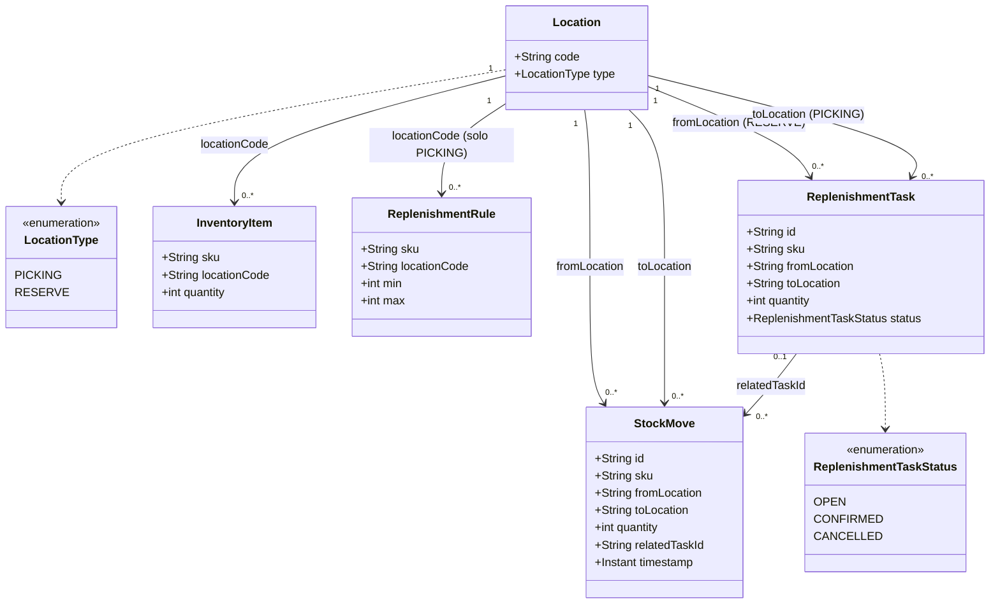
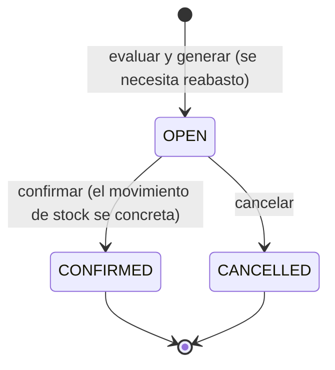
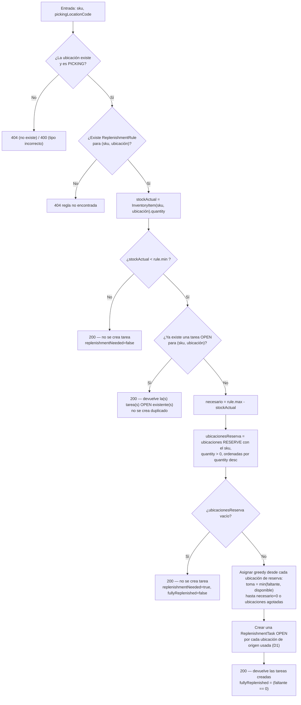
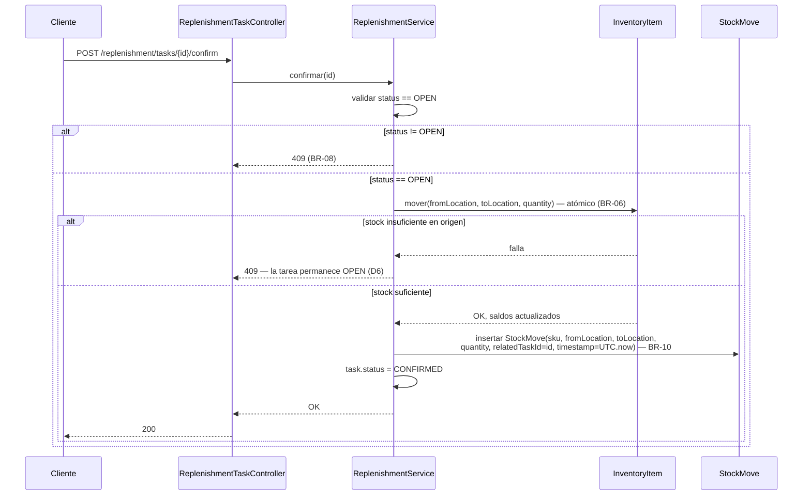

# Especificación de Requisitos de Software — Módulo de Reabasto WMS

| | |
|---|---|
| **Versión** | 1.0 |
| **Estado** | Aprobado |
| **Fecha** | 2026-09-20 |
| **Alcance** | Modelado de dominio y definición de requisitos, previo al diseño de arquitectura y la implementación |

---

## 1. Introducción

### 1.1 Propósito

Este documento especifica los requisitos funcionales y no funcionales, y el modelo de dominio, del
**Módulo de Reabasto WMS**: un microservicio Spring Boot que modela el inventario de un depósito repartido
en ubicaciones y gestiona el reabasto de ubicaciones de picking desde ubicaciones de reserva.

Desarrolla el enunciado de [`SPECS.md`](../SPECS.md), que sigue siendo la referencia autoritativa para los
contratos literales de cada endpoint y los criterios de aceptación. Donde `SPECS.md` deja el comportamiento
deliberadamente indefinido ("tomalas vos y seguí"), este documento toma la decisión de diseño y la
justifica, para que la implementación cuente con una especificación clara y revisable.

### 1.2 Alcance

Dentro del alcance: modelar ubicaciones, inventario (quants), reglas de reabasto y tareas de reabasto;
evaluar y generar tareas de reabasto; mover stock de forma atómica y registrar su historial trazable;
exponer todo lo anterior como una API REST documentada.

Fuera de alcance (lista completa en §2.6): autenticación/autorización, múltiples depósitos o tenants, el
picking de pedidos en sí, la compra o recepción de mercadería hacia reserva, la gestión de datos maestros de
SKU y una interfaz de usuario.

### 1.3 Definiciones, Siglas y Abreviaturas

| Término | Significado |
|---|---|
| WMS | Warehouse Management System — sistema de gestión de depósito. |
| SKU | Stock Keeping Unit — identificador de un producto. No es una entidad gestionada aparte en este módulo: existe implícitamente donde se lo referencia. |
| Ubicación (Location) | Lugar físico del depósito donde se guarda stock; puede ser `PICKING` o `RESERVE`. |
| Ubicación de picking | Ubicación chica y de fácil acceso donde los operarios buscan producto para armar pedidos. Tiene umbrales `min`/`max` por SKU. |
| Ubicación de reserva | Ubicación de almacenamiento masivo (racks, pallets). Sin umbrales; es el origen del reabasto. |
| Quant | Término WMS para "cuánto hay de un SKU en una ubicación dada" — modelado acá como `InventoryItem`. |
| Reabasto (Replenishment) | Mover stock de reserva a picking para que el stock de picking vuelva a acercarse a su `max`. |
| FSM | Finite State Machine — máquina de estados finitos. |
| DTO | Data Transfer Object. |

### 1.4 Referencias

- `../SPECS.md` — el enunciado del challenge (contratos de endpoints, datos semilla y criterios de
  aceptación autoritativos).
- `../CLAUDE.md` — convenciones del código base verificadas (organización de módulos, manejo de errores,
  validación, testing).
- `../README.MD` — cómo levantar la app y la feature de ejemplo `User` existente.

### 1.5 Resumen del documento

§2 plantea el problema y enumera cada supuesto/decisión de diseño que este documento agrega sobre
`SPECS.md`. §3 define el modelo de dominio. §4 define los requisitos funcionales por grupo de endpoints.
§5 define las convenciones de la interfaz (HTTP/API) externa. §6 define los requisitos no funcionales.
§7 retoma los datos semilla como requisito. §8 traza los requisitos hasta los criterios de aceptación del
enunciado.

---

## 2. Descripción General

### 2.1 Perspectiva del Producto

Un microservicio backend independiente, construido sobre el template Spring Boot 3.5.4 / Java 24 con
arquitectura hexagonal provisto. No tiene integraciones upstream/downstream en esta iteración — todo el
estado es en memoria y pertenece a este servicio. Sigue la separación de módulos `domain` / `api` / `infra`
/ raíz de la app y las convenciones ya establecidas por la feature de ejemplo `User` del template
(documentadas en `CLAUDE.md`).

### 2.2 Funciones del Producto (resumen)

1. Registrar y listar ubicaciones del depósito.
2. Trackear cuánto hay de cada SKU en cada ubicación (cargar stock, consultar stock).
3. Mover stock entre dos ubicaciones de forma atómica.
4. Definir umbrales de reabasto (min/max) por SKU para ubicaciones de picking.
5. Evaluar el stock de una ubicación de picking contra su umbral y, cuando corresponda, generar tareas de
   reabasto con origen en ubicaciones de reserva.
6. Listar, confirmar y cancelar tareas de reabasto; confirmar ejecuta el movimiento de stock real.
7. Consultar el historial trazable de movimientos de stock (qué se movió, cuándo, de dónde a dónde).

### 2.3 Actores

| Actor | Descripción |
|---|---|
| Operario de depósito | Consume la API (vía una UI de WMS integrada, fuera de alcance acá, o directamente) para cargar stock, revisar tareas de reabasto y confirmarlas/cancelarlas después de ejecutar el movimiento físico. |
| Disparador de reabasto | Quien llame a `POST /replenishment/tasks` — una persona, un job programado u otro sistema. Este módulo no se autodispara; el disparo es externo y queda fuera de alcance. |
| Cliente API / Integrador | Cualquier sistema que consuma el contrato REST/OpenAPI documentado. |

No hay distinción de actor por autenticación/autorización — ver §2.6.

### 2.4 Restricciones

- Stack: Java 24, Spring Boot 3.5.4, arquitectura hexagonal multi-módulo con Gradle (fijado por el
  template).
- Persistencia: en memoria (explícitamente permitida y la expectativa por defecto del enunciado).
- Debe seguir el layering y las convenciones ya verificadas en el código base (`CLAUDE.md`): el dominio se
  mantiene libre de framework, el wiring de beans es manual, no hay Bean Validation, el manejo de errores es
  por controller.
- Sin base de datos, sin servicios externos, sin llamadas de red.

### 2.5 Supuestos y Decisiones de Diseño

El enunciado deja estos puntos abiertos deliberadamente ("no hay una única respuesta correcta... tomalas
vos, documentalas y seguí"). Cada decisión de abajo es una elección deliberada, no un olvido.

| # | Tema | Decisión | Justificación |
|---|---|---|---|
| D1 | Múltiples orígenes de reserva para un reabasto | `ReplenishmentTask` tiene un único `fromLocation`, según el modelo mínimo del enunciado. Cuando una ubicación de picking necesita más stock del que puede aportar una sola ubicación de reserva, el sistema crea **una tarea por cada ubicación de reserva utilizada**, todas con el mismo `sku`/`toLocation`, sumando en conjunto la cantidad total necesaria (limitada por lo disponible). | Preserva exactamente la forma de entidad dada (`fromLocation` singular) y a la vez cumple con "mover producto desde una o más ubicaciones de reserva" de la introducción. Cada tarea también corresponde 1 a 1 con un único picking físico desde una única ubicación de reserva — algo realista operativamente. |
| D2 | Orden de selección de origen en reserva | Cuando más de una ubicación de reserva tiene el SKU, se eligen los orígenes de forma **greedy, por cantidad disponible descendente** (mayor primero), hasta alcanzar el objetivo o agotar el stock de reserva. | Minimiza la cantidad de tareas/movimientos generados para un reabasto dado: menos movimientos, pero más grandes, es la heurística operativa estándar cuando no hay datos de FEFO/lote para priorizar (este modelo no los tiene). |
| D3 | Stock de reserva total insuficiente | El reabasto es **parcial, no se rechaza**: el sistema crea la(s) tarea(s) con lo que haya disponible en reserva, aunque no alcance el `max`. La respuesta de evaluación informa si se llegó al objetivo completo (ver FR-TSK-01). Si el stock de reserva del SKU es `0` en todos lados, no se crea ninguna tarea; es un resultado de negocio válido (`200`), no un error. | "No hay stock suficiente para reabastecer del todo" es una realidad operativa esperable, no un pedido malformado ni en conflicto — no encaja en la semántica de `400`/`404`/`409`, por lo que es una respuesta `200` que describe lo que se pudo hacer. |
| D4 | Idempotencia de evaluar/generar | Si ya existe una tarea `OPEN` para el par `(sku, ubicación de picking)` solicitado (de cualquier origen), no se crea una tarea nueva; se devuelve la(s) tarea(s) `OPEN` existente(s). | Evita duplicar trabajo de reabasto pendiente para la misma necesidad. Llamadas repetidas a "evaluar" (por ejemplo, desde un reintento o un scheduler) no deben acumular tareas. |
| D5 | Resultado "no se necesita reabasto" | Si el stock actual ya es `>= min`, el endpoint responde `200` sin crear ninguna tarea y con `replenishmentNeeded: false` explícito, no un error. | Es el resultado exitoso y habitual de una evaluación, no una falla. |
| D6 | Faltante de stock al momento de confirmar | Si al confirmar una tarea la ubicación de reserva de origen ya no tiene stock suficiente (el estado cambió desde que se creó la tarea), el movimiento subyacente falla y devuelve `409 Conflict`; la tarea **permanece `OPEN`** — no se cancela ni se completa a la fuerza en silencio. | La transición `OPEN → CONFIRMED` debe ocurrir únicamente cuando el movimiento de stock realmente se concreta, preservando el invariante "atómico, nunca a medias" de `SPECS.md` también a nivel de la tarea, no solo del movimiento. |
| D7 | Referencia a una ubicación de tipo incorrecto | Una referencia a una ubicación *existente* pero de tipo incorrecto para la operación (por ejemplo, una ubicación `RESERVE` donde una regla requiere `PICKING`) es un `400 Bad Request`, distinto de una ubicación inexistente (`404`). | El recurso existe (no hay ambigüedad sobre su identidad), pero el pedido es semánticamente inválido — más cercano a un pedido malformado que a un recurso faltante o un conflicto de estado. |
| D8 | Identidad de `InventoryItem` | Sin ID sustituto. Se identifica por la clave compuesta natural `(sku, locationCode)`. `POST /stock` es un **set/upsert**, no un incremento (según la propia redacción del enunciado, "establece"). Poner la cantidad en `0` conserva el registro (no lo elimina) — un SKU trackeado con stock cero es información con sentido. | Coincide con la semántica de "establece" del propio enunciado; evita inventar un ID que el enunciado nunca pide; mantiene el comportamiento de lectura (§FR-STK-02) predecible sin importar el historial. |
| D9 | Identidad de `ReplenishmentRule` | Tampoco tiene ID sustituto — clave compuesta natural `(sku, locationCode)`, coherente con su propia regla de unicidad ("no puede haber dos reglas para el mismo SKU + ubicación"). | Misma razón que D8; la restricción de unicidad ya implica que esta es la clave natural. |
| D10 | Umbrales del lado de reserva | Las ubicaciones de reserva no tienen `min`/`max` y nunca son reabastecidas a su vez en este módulo — tomar stock de reserva nunca chequea ni exige un stock de seguridad de reserva. | Explícitamente fuera de alcance según el enunciado (la compra/recepción no está modelada); mantiene simple el algoritmo de D2 y coincide con el modelo de dominio dado, que solo asocia `ReplenishmentRule` a ubicaciones de picking. |
| D11 | El tipo de ubicación es inmutable | Una vez creada, el `type` de una ubicación no cambia (no existe un endpoint de actualización de ubicación en `SPECS.md`). | El enunciado no lo pide; mantenerlo inmutable evita tener que revalidar cada `InventoryItem`/`ReplenishmentRule`/`ReplenishmentTask` dependiente ante un cambio de tipo. |
| D12 | Tipos de cantidad | Todas las cantidades (`InventoryItem.quantity`, `min`, `max`, `quantity` de movimiento/tarea) son enteros no negativos; las cantidades de movimiento y de tarea además deben ser estrictamente positivas (`0` es un no-op, se rechaza con `400`). | Coincide con los ejemplos enteros de todo `SPECS.md`; los quants de un WMS son conteos de unidades, no fraccionarios. |
| D13 | Historial de movimientos (`StockMove`) | Se agrega `StockMove` como registro **inmutable y append-only**, modelado sobre `stock.move` de Odoo 19: no tiene estados, solo se inserta en el instante exacto en que el stock se mueve atómicamente, nunca se edita ni se elimina. Si un operario se equivoca, la corrección es un nuevo movimiento compensatorio en sentido inverso, no una edición del registro original. | Surge del "nice to have" de `SPECS.md` ("historial trazable"). Un log de auditoría que se puede editar deja de ser confiable como auditoría; el patrón append-only + compensación es el estándar de la industria (Odoo, contabilidad de doble entrada) para este problema. |
| D14 | Qué genera un `StockMove` | Solo las operaciones que mueven stock **entre dos ubicaciones** generan un `StockMove`: `POST /stock/move` y la confirmación de una tarea de reabasto (que reutiliza esa misma operación, per BR-09). `POST /stock` (que establece una cantidad absoluta en una sola ubicación, D8) y la carga inicial del seeder **nunca** generan `StockMove`, porque ninguna de las dos es un movimiento con origen y destino. | Mantiene la semántica de "movimiento" estricta: un `StockMove` siempre tiene `fromLocation` y `toLocation` distintos con sentido físico. El stock inicial es un estado de partida del sistema, no un evento de movimiento. |
| D15 | Exposición del historial | Se agrega `GET /stock/moves`, filtrable opcionalmente por `sku`, `location` (matchea contra `fromLocation` o `toLocation`) y `relatedTaskId`, devuelto en orden **más reciente primero**. | Sin este endpoint el historial no sería "trazable" desde afuera — el sistema es en memoria y solo API, no hay otra forma de consultar el log. Es una extensión mínima y directa sobre el modelo de `StockMove`, coherente con el resto del diseño. |

### 2.6 Fuera de Alcance

- Autenticación, autorización, multi-tenancy.
- Soporte multi-depósito (todas las ubicaciones pertenecen a un único depósito implícito).
- Picking / gestión de pedidos.
- Compra o recepción de mercadería hacia ubicaciones de reserva.
- Datos maestros de SKU (descripciones, categorías, conversiones de unidad de medida).
- Programación/disparo de la evaluación de reabasto (externo a este módulo).
- Almacenamiento persistente/relacional (explícitamente opcional según el "nice to have" de `SPECS.md`; el
  historial de movimientos sí queda en alcance, ver D13–D15, pero sigue siendo en memoria).

---

## 3. Modelo de Dominio

### 3.1 Entidades y Objetos de Valor

| Entidad | Atributos | Notas |
|---|---|---|
| `Location` | `code: string` (clave natural, única), `type: LocationType` | `LocationType = PICKING \| RESERVE`. |
| `InventoryItem` | `sku: string`, `locationCode: string`, `quantity: int (>= 0)` | Clave compuesta `(sku, locationCode)` — ver D8. |
| `ReplenishmentRule` | `sku: string`, `locationCode: string` (debe referenciar una ubicación `PICKING`), `min: int (>= 0)`, `max: int (>= min)` | Clave compuesta `(sku, locationCode)` — ver D9. |
| `ReplenishmentTask` | `id: string` (generado por el sistema), `sku: string`, `fromLocation: string` (debe ser `RESERVE`), `toLocation: string` (debe ser `PICKING`), `quantity: int (> 0)`, `status: ReplenishmentTaskStatus` | `ReplenishmentTaskStatus = OPEN \| CONFIRMED \| CANCELLED`. |
| `StockMove` | `id: string` (generado por el sistema), `sku: string`, `fromLocation: string`, `toLocation: string`, `quantity: int (> 0)`, `relatedTaskId: string \| null`, `timestamp: Instant (UTC)` | **Inmutable, append-only** (D13). `relatedTaskId` es `null` para un movimiento manual (`POST /stock/move`) y apunta al `ReplenishmentTask.id` cuando el movimiento viene de una confirmación (D14). |

### 3.2 Relaciones

### 3.3 Invariantes de Negocio

| ID | Invariante |
|---|---|
| BR-01 | `Location.code` es único en todo el sistema. |
| BR-02 | `ReplenishmentRule` solo puede referenciar una `Location` de tipo `PICKING`. |
| BR-03 | `ReplenishmentRule.min <= ReplenishmentRule.max`, ambos `>= 0`. |
| BR-04 | Como máximo una `ReplenishmentRule` por `(sku, locationCode)`. |
| BR-05 | `InventoryItem.quantity` nunca es negativo, en ningún momento. |
| BR-06 | Un movimiento de stock (`POST /stock/move`, y la confirmación de una tarea) es atómico: o se actualizan ambos lados, o no se actualiza ninguno. |
| BR-07 | El `fromLocation` de una `ReplenishmentTask` debe ser `RESERVE`; el `toLocation` debe ser `PICKING`. |
| BR-08 | El estado de una `ReplenishmentTask` solo transiciona `OPEN → CONFIRMED` u `OPEN → CANCELLED`; `CONFIRMED` y `CANCELLED` son terminales (sin transiciones posteriores, sin mutación de campos). |
| BR-09 | Confirmar una `ReplenishmentTask` ejecuta el mismo movimiento atómico de BR-06, de `fromLocation` a `toLocation`, por `quantity`. |
| BR-10 | Todo movimiento de stock exitoso entre dos ubicaciones (`POST /stock/move` o la confirmación de una tarea) inserta, dentro de la misma transacción atómica de BR-06, exactamente un `StockMove` con `sku`, `fromLocation`, `toLocation`, `quantity`, `relatedTaskId` y `timestamp` (D13/D14). Si el movimiento falla, no se inserta ningún `StockMove`. |
| BR-11 | Un `StockMove` es inmutable: ningún camino de código lo edita ni lo elimina una vez insertado. Una corrección se modela como un nuevo `StockMove` compensatorio en sentido inverso (D13). |

### 3.4 Máquina de Estados de `ReplenishmentTask`

Cualquier intento de transición fuera de `CONFIRMED` o `CANCELLED` se rechaza con `409 Conflict` (BR-08).

### 3.5 Proceso Central de Dominio — Evaluación de Reabasto

### 3.6 Confirmación de Tarea de Reabasto — Efecto Atómico

La confirmación es la relación de causa y efecto entre la máquina de estados (BR-08) y el historial
(BR-10): la primera gestiona "qué hay que hacer", el segundo custodia "qué ocurrió realmente". Las tres
consecuencias — transición de estado, actualización de saldos e inserción del `StockMove` — ocurren dentro
de una única transacción atómica, o ninguna ocurre.

---

## 4. Requisitos Funcionales

Los IDs de requisitos son identificadores estables para trazabilidad hacia diseño/tareas/tests. Los códigos
de status siguen la convención definida en §5.2.

### 4.1 Ubicaciones

| ID | Requisito |
|---|---|
| FR-LOC-01 | `POST /locations` crea una `Location` a partir de `{code, type}`. `type` debe ser `PICKING` o `RESERVE` (`400` si no). `code` debe ser único (`409` si ya existe). |
| FR-LOC-02 | `GET /locations` devuelve todas las ubicaciones. |

### 4.2 Stock

| ID | Requisito |
|---|---|
| FR-STK-01 | `POST /stock` establece (upsert, según D8) la cantidad de `{sku, locationCode, quantity}`. `locationCode` debe referenciar una ubicación existente (`404` si no). `quantity` debe ser `>= 0` (`400` si no). |
| FR-STK-02 | `GET /stock?sku={sku}` devuelve cada `InventoryItem` de ese SKU en todas sus ubicaciones (lista vacía si no hay ninguno — no es un error). `GET /stock?location={code}` filtra por ubicación en su lugar; ambos parámetros pueden combinarse como filtro AND. |
| FR-STK-03 | `POST /stock/move` mueve `quantity` del `sku` desde `from` hacia `to`. Ambas ubicaciones deben existir (`404`). `from != to` (`400`). `quantity > 0` (`400`). El origen debe tener `quantity >= lo solicitado` (`409` si no, según D6/BR-06). La operación es atómica (BR-06) e inserta un `StockMove` con `relatedTaskId=null` (BR-10). |

### 4.3 Reglas de Reabasto

| ID | Requisito |
|---|---|
| FR-RUL-01 | `POST /replenishment-rules` crea una `ReplenishmentRule` a partir de `{sku, locationCode, min, max}`. `locationCode` debe existir (`404`) y ser `PICKING` (`400`, según D7/BR-02). `0 <= min <= max` (`400`, BR-03). No debe existir ya una regla para el mismo `(sku, locationCode)` (`409`, BR-04). |

### 4.4 Tareas de Reabasto

| ID | Requisito |
|---|---|
| FR-TSK-01 | `POST /replenishment/tasks` evalúa `{sku, locationCode}` según §3.5. `locationCode` debe existir y ser `PICKING` (`404`/`400`, D7). Debe existir una `ReplenishmentRule` para el par (`404` si no). La respuesta informa `replenishmentNeeded`, `fullyReplenished` y la lista de tareas creadas (o las `OPEN` preexistentes, según D4) — `0..n` tareas, según D1/D3/D5. Siempre `200` ante un pedido bien formado (D5). |
| FR-TSK-02 | `GET /replenishment/tasks` devuelve todas las tareas, sin importar el estado. |
| FR-TSK-03 | `POST /replenishment/tasks/{id}/confirm` transiciona una tarea `OPEN` a `CONFIRMED` y ejecuta el movimiento (BR-09), insertando un `StockMove` con `relatedTaskId={id}` (BR-10) — ver §3.6. `id` inexistente → `404`. Tarea que no está `OPEN` → `409` (BR-08). El movimiento falla por stock insuficiente en el origen → `409`, la tarea permanece `OPEN` y no se inserta `StockMove` (D6/BR-10). |
| FR-TSK-04 | `POST /replenishment/tasks/{id}/cancel` transiciona una tarea `OPEN` a `CANCELLED`; no se mueve stock y no se inserta `StockMove`. `id` inexistente → `404`. Tarea que no está `OPEN` → `409` (BR-08). |

### 4.5 Historial de Movimientos (Stock Moves)

| ID | Requisito |
|---|---|
| FR-MOV-01 | `GET /stock/moves` devuelve el historial de `StockMove` (D13–D15), más reciente primero. Filtros opcionales: `sku`, `location` (matchea `fromLocation` o `toLocation`), `relatedTaskId`. Lista vacía si no hay movimientos que cumplan el filtro — no es un error. Los registros nunca se editan ni se eliminan (BR-11); no existen endpoints de escritura para este recurso más allá de la inserción implícita de FR-STK-03/FR-TSK-03. |

---

## 5. Requisitos de Interfaz Externa

### 5.1 Descripción General de la API

Todos los endpoints son relativos al context path existente `/api/templates` (sin cambios en esta
iteración — ver `CLAUDE.md`). Los cuerpos de request/response son JSON. Los endpoints nuevos siguen las
mismas convenciones de anotaciones OpenAPI/Swagger ya usadas por la feature `User` (`@Tag`, `@Operation`,
`@ApiResponses`, `@Schema` en los DTOs).

### 5.2 Convención de Manejo de Errores

Aplica una única convención consistente en todos los endpoints de este módulo, reutilizando el
`ErrorResponse` existente:

| Status | Cuándo |
|---|---|
| `400 Bad Request` | El pedido está malformado o viola una regla que nunca puede tener éxito sin importar el estado del sistema: valor de enum inválido, cantidad negativa o no positiva donde se requiere una positiva, `min > max`, `from == to`, una referencia a ubicación de tipo incorrecto (D7). |
| `404 Not Found` | Un recurso referenciado (`code` de ubicación, `id` de tarea, o una regla `(sku, locationCode)`) no existe. |
| `409 Conflict` | El pedido está bien formado y sus recursos referenciados existen, pero el estado actual impide la operación: `Location.code` duplicado (BR-01), regla duplicada (BR-04), stock insuficiente para un movimiento (BR-06), transición de FSM inválida (BR-08). |

Ningún endpoint devuelve un `500` genérico para ninguno de los casos enumerados arriba (criterio de
aceptación #2 del enunciado).

### 5.3 Documentación

Cada endpoint nuevo debe documentarse en OpenAPI/Swagger con el mismo estándar que la feature `User`
existente: con tag, descripción, y esquemas de respuesta tanto para el caso exitoso como para cada status de
error documentado (criterio de aceptación #3 del enunciado).

---

## 6. Requisitos No Funcionales

| ID | Requisito |
|---|---|
| NFR-01 Mantenibilidad | El código nuevo respeta los límites hexagonales existentes: `domain` se mantiene libre de framework; `infra` es dueño del wiring de Spring y los adapters; `api` es dueño de los DTOs. |
| NFR-02 Testeabilidad | Las reglas de negocio de reabasto (§3.5, D1–D6) deben poder testearse a nivel unitario contra la capa de dominio en aislamiento, sin contexto de Spring (criterio de aceptación #4 del enunciado). Esto es un hueco respecto al repo actual, que no tiene tests unitarios a nivel de dominio (ver `CLAUDE.md`, sección Testing). |
| NFR-03 Consistencia | BR-05/BR-06/BR-09/BR-10 (sin stock negativo, movimientos atómicos, inserción del `StockMove` en la misma transacción) deben cumplirse bajo pedidos concurrentes contra la(s) misma(s) ubicación(es), no solo de forma secuencial. |
| NFR-04 Concurrencia | El almacenamiento en memoria debe serializar o coordinar de forma segura las mutaciones concurrentes sobre los mismos registros de `InventoryItem`/`ReplenishmentTask`; un `ConcurrentHashMap` por sí solo no alcanza para garantizar BR-06 ante movimientos concurrentes (una condición de carrera del tipo check-then-act). |
| NFR-05 Claridad de la API | Cada respuesta exitosa y de error, de cada endpoint, está documentada (§5.3) y devuelve un mensaje accionable por el cliente ante un error, no un stack trace ni un texto genérico (criterio de aceptación #2 del enunciado). |
| NFR-06 Extensibilidad | La estrategia de selección de ubicación de reserva (D2) debe quedar aislada en un único punto del servicio de dominio, de modo que una estrategia distinta (por ejemplo, FEFO cuando existan datos de lote) pueda reemplazarla sin tocar controllers ni DTOs. |
| NFR-07 Auditabilidad | `StockMove` es append-only (BR-11): ningún camino de código —incluyendo tests, seeders o futuras features— debe exponer una forma de editar o eliminar un registro existente. Cualquier corrección se modela como un nuevo movimiento compensatorio. |

Los objetivos de performance/escala quedan deliberadamente sin especificar: es un servicio de un solo nodo,
en memoria, con un dataset semilla pequeño (§7), y el enunciado no define ningún requisito de carga.

---

## 7. Requisitos de Datos — Datos Semilla

Reproducidos desde `SPECS.md` como requisito: la aplicación debe sembrar exactamente este escenario al
arrancar, y el README debe documentar cómo (re)dispararlo.

**Ubicaciones**: `PICK-01`, `PICK-02` (`PICKING`) · `RSV-01`, `RSV-02`, `RSV-03` (`RESERVE`)

**Reglas de reabasto**

| SKU | Ubicación | Min | Max |
|---|---|---|---|
| SKU-100 | PICK-01 | 20 | 100 |
| SKU-200 | PICK-01 | 10 | 50 |
| SKU-300 | PICK-02 | 30 | 120 |

**Stock inicial**

| SKU | Ubicación | Cantidad |
|---|---|---|
| SKU-100 | PICK-01 | 5 |
| SKU-200 | PICK-01 | 40 |
| SKU-300 | PICK-02 | 10 |
| SKU-100 | RSV-01 | 60 |
| SKU-100 | RSV-02 | 50 |
| SKU-300 | RSV-03 | 70 |

Nota (relevante para D2/D3, conviene validarla una vez implementado): con esta semilla, evaluar `SKU-100` en
`PICK-01` necesita `100 - 5 = 95` unidades; reserva tiene `60 + 50 = 110` (suficiente — se esperan 2 tareas,
primero `RSV-01` con 60, luego `RSV-02` con las 35 restantes, según el orden de mayor a menor de D2).
Evaluar `SKU-300` en `PICK-02` necesita `120 - 10 = 110`; reserva solo tiene `70` en `RSV-03` — un caso de
reabasto parcial (D3), se espera exactamente una tarea de `70` unidades y `fullyReplenished=false`.
`SKU-200` en `PICK-01` tiene `stock=40 >= min=10` — la evaluación corta en D5 ("no se necesita reabasto")
antes de llegar siquiera a mirar reserva, sin importar que no tenga stock de `RESERVE` sembrado. El caso
D3 de "ubicacionesReserva vacío" (paso L del diagrama de flujo) no está representado en la semilla; se
prueba con datos ad hoc.

Por D14, la carga del stock inicial por el seeder **no genera ningún `StockMove`**: es el estado de partida
del sistema, no un movimiento entre dos ubicaciones. El historial (`GET /stock/moves`) arranca vacío
inmediatamente después del seed, y solo empieza a poblarse con el primer `POST /stock/move` o la primera
confirmación de tarea.

---

## 8. Trazabilidad con los Criterios de Aceptación

| Criterio de aceptación del enunciado | Cubierto por |
|---|---|
| 1. Todos los endpoints funcionan de punta a punta, probables vía Swagger/curl | §4 (todos los FR-*), §5.3 |
| 2. Status HTTP correcto por error, sin `500` genéricos | §5.2, y la columna de error de cada fila FR-* |
| 3. API documentada en OpenAPI/Swagger | §5.3, NFR-05 |
| 4. Reglas de negocio del reabasto cubiertas por tests | NFR-02, BR-06/07/08/09, D1–D6 |
